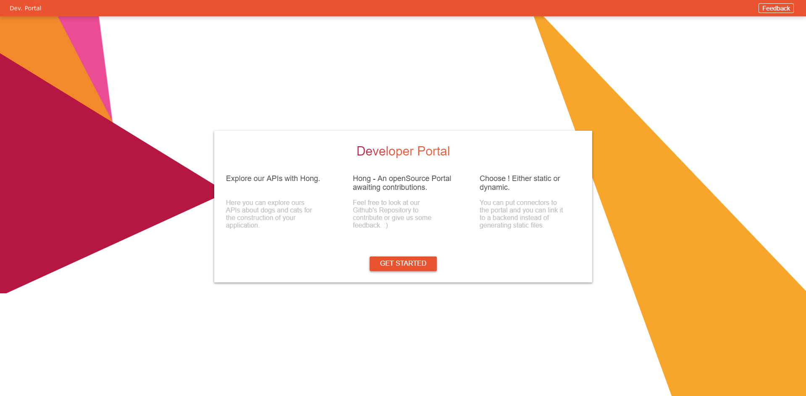
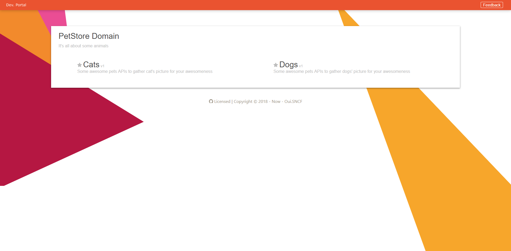

<div align="center">
<h1>Gatui - Developer Portal</h1>
</div>

<table>
    <tr>
        <td>
            
        </td>
        <td>
            
        </td>
    </tr>
</table>

[(Live Démo)](https://salty-beach-47815.herokuapp.com/#/) [](https://heroku.com/deploy)


------------------------------------
[](https://travis-ci.org/voyages-sncf-technologies/gatui)


[Gatui](http://live.demo.fr) provides an interactive and attractive developer
portal for your apis that can be deployed anywhere, into your cycle of continious
integration and lifecycle for example.

## Prerequisites

- Node 9.11.1

## Installing

To get the development env running

Go to the front folder and install dependencies with npm or yarn

```
npm install -g yarn
yarn install
```

Start the development version

```
yarn start
```

Go to [http://locahost:8080](http://localhost:8080).


# Running the tests
-----------------------------------

Right now, there are no automatised tests that are made. It's in the todo-list.

# Deployment
-----------------------------------

To deploy Gatui with docker, you must first build the image.

```
cd front/
docker build -t Gatui .
```

And we can start the docker now

```
docker run -p 8888:80 Gatui
```

Go to [http://localhost:8888].

NB: If you want to add a dynamic source of data for the documentation, it's
possible, refer to [docs/configuration.md]().

# Build With
-----------------------------------

- [VueJS 2.0](http://vuejs.com)
- [VueX]()
- [Swagger-ui]()
- [Webpack 4]()

# Contributing
-----------------------------------

Please read [CONTRIBUTING.md]() for details on our code of conduct, and the
process for submitting pull requests to us.

# Versioning 
-----------------------------------

We'll use [SemVer](https://semver.org/) for versioning. The versions available will be listed by tag
on this repository.

# Authors
-----------------------------------

- **Anthony Griffon** - @miaxos - Initial work - V1.0

See also the list of [contributors]() who participated in this project.

# License
-----------------------------------

This project is licensed under the GPL 3.0 License - see the [LICENSE.md]() file
for details

# Acknowledgments
-----------------------------------

- Every author for the npm dependencies
- Laurent Michelet - Internship mentor
- Google - for inspiration
- [README.md Template](https://gist.github.com/PurpleBooth/109311bb0361f32d87a2) by @PurpleBooth
- Lucas Cimon - @lucas-c - for help in OpenSourcing